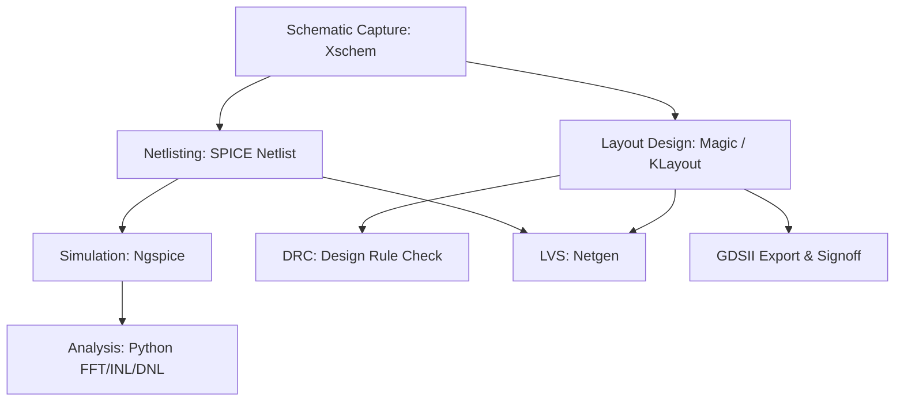

# 🛠️ Panduan Lengkap Akses & Penggunaan EDA Tools Chipathon 2026
**Target PDK:** GlobalFoundries 180nm MCU (GF180MCU 3.3V)  
**Container Environment:** `hpretl/iic-osic-tools:latest`

Dokumen ini berisi aturan lengkap, konfigurasi sistem, serta tata cara penggunaan EDA tools untuk merancang IC Analog/Mixed-Signal (seperti SAR ADC 8-bit asinkron) dalam ajang Chipathon 2026.

---

## 📋 Daftar Isi
1. [Struktur Alur Kerja (EDA Toolchain)](#1-struktur-alur-kerja-eda-toolchain)
2. [Prasyarat & Konfigurasi Host Linux](#2-prasyarat--konfigurasi-host-linux)
3. [Panduan Akses Kontainer Docker (`iic-osic-tools`)](#3-panduan-akses-kontainer-docker-iic-osic-tools)
4. [Perintah Utama & Workflow Desain](#4-perintah-utama--workflow-desain)
5. [Rules & Best Practices Penggunaan Agent / Manual](#5-rules--best-practices-penggunaan-agent--manual)
6. [Troubleshooting Umum](#6-troubleshooting-umum)

---

## 1. Struktur Alur Kerja (EDA Toolchain)

Alur perancangan IC Analog & Mixed-Signal pada PDK GF180MCU memanfaatkan kombinasi perangkat lunak open-source berikut:



* **Schematic Entry**: **Xschem** (dengan simbol GF180MCU).
* **Circuit Simulation**: **Ngspice** (transient, AC, Monte Carlo, corner analysis).
* **Layout & DRC**: **Magic VLSI** & **KLayout**.
* **LVS (Layout vs Schematic)**: **Netgen**.
* **RTL-to-GDS (Digital Logic)**: **OpenROAD** / **Yosys**.

---

## 2. Prasyarat & Konfigurasi Host Linux

Sebelum mengakses tools di dalam kontainer Docker, pastikan host Linux sudah terkonfigurasi dengan benar.

### A. Izin User Docker
Agar pengguna dan Agent AI dapat menjalankan Docker tanpa permintaan kata sandi `sudo`:
```bash
sudo usermod -aG docker $USER
# Terapkan perubahan grup:
newgrp docker
```

### B. Konfigurasi GUI (X11 Forwarding)
Aplikasi berbasis GUI (Xschem, Magic, KLayout, plot Ngspice) membutuhkan izin akses ke Display Server host:
```bash
# Berikan izin ke semua koneksi lokal di host:
xhost +local:
```
*Pastikan variabel environment `DISPLAY` diset ke `:0` atau pasangannya (contoh: `export DISPLAY=:0`).*

---

## 3. Panduan Akses Kontainer Docker (`iic-osic-tools`)

Kontainer `hpretl/iic-osic-tools:latest` berisi seluruh PDK GF180MCU dan EDA tools yang sudah terkonfigurasi pada direktori `/foss/tools` dan `/foss/pdks`.

### Cara 1: Menggunakan Script Launcher (`run_docker_iic.sh`) - Rekomendasi
Skrip ini sudah tersedia di direktori `scripts/run_docker_iic.sh` repositori ini.

1. **Masuk ke Mode Shell Interaktif (Bash Container):**
   ```bash
   cd ~/eda/designs/chipathon26-SAR_ADC
   ./scripts/run_docker_iic.sh
   ```
2. **Eksekusi Perintah Satu Baris (One-Shot Command / Batch Mode):**
   ```bash
   # Simulasi SPICE tanpa GUI (Batch Mode):
   ./scripts/run_docker_iic.sh ngspice -b xschem/sar_adc/tb_sar_adc_dynamic.spice

   # Membuka skematik di Xschem:
   ./scripts/run_docker_iic.sh xschem xschem/sar_adc/sar_adc_top.sch
   ```

### Cara 2: Menjalankan Perintah Manual `docker run`
Jika dijalankan secara manual dari direktori host:
```bash
docker run --rm -it \
    --name chipathon-2026-iic \
    --user "$(id -u):$(id -g)" \
    -e DISPLAY=$DISPLAY \
    -v /tmp/.X11-unix:/tmp/.X11-unix:rw \
    -v "$HOME/eda:/foss/designs" \
    -w /foss/designs/chipathon26-SAR_ADC \
    hpretl/iic-osic-tools:latest \
    bash
```

---

## 4. Perintah Utama & Workflow Desain

### 📊 A. Skematik & Simulasi (Xschem + Ngspice)
* **Membuka Skematik Utama SAR ADC:**
  ```bash
  xschem xschem/sar_adc/sar_adc_top.sch
  ```
* **Menjalankan Simulasi SPICE:**
  ```bash
  # Mode Batch (Cepat, untuk ekstraksi Python)
  ngspice -b xschem/sar_adc/tb_sar_adc_dynamic.spice
  ```
* **Ekstraksi Performa ADC via Python:**
  ```bash
  python3 xschem/sar_adc/calc_dynamic.py
  python3 xschem/sar_adc/calc_static.py
  ```

### 📐 B. Layout & Verifikasi Physical (Magic + Netgen + KLayout)
* **Membuka Magic dengan PDK GF180MCU:**
  ```bash
  magic -T gf180mcuD
  ```
* **Menjalankan Netgen LVS:**
  ```bash
  netgen -b
  ```
* **Membuka Layout Viewer KLayout:**
  ```bash
  klayout final/gds/sar_adc.gds
  ```

---

## 5. Rules & Best Practices Penggunaan Agent / Manual

> [!IMPORTANT]
> **RULE 1: Penggunaan User ID Host (`--user $(id -u):$(id -g)`)**  
> Selalu jalankan kontainer dengan UID/GID lokal. Hal ini mencegah file hasil simulasi (`.raw`), log, dan skematik berubah kepemilikannya menjadi `root`.

> [!WARNING]
> **RULE 2: Efisiensi Memori Ngspice (Mencegah Crash Out of Memory)**  
> * Dilarang menggunakan `.save all` untuk simulasi transien yang panjang.
> * Deklarasikan secara spesifik node yang diukur, contoh:  
>   `.save v(vin) v(done) v(dout[7]) v(dout[6]) v(dout[5]) v(dout[4]) v(dout[3]) v(dout[2]) v(dout[1]) v(dout[0])`
> * Gunakan toleransi numerik yang sesuai untuk rangkaian digital/mixed-signal:  
>   `.options method=gear reltol=1e-2 vntol=1m abstol=1n`

> [!TIP]
> **RULE 3: Pengeditan File Skematik (.sch) vs SPICE Netlist**  
> * Selalu edit sirkuit melalui file skematik Xschem (`.sch`).
> * Netlist `.spice` yang digunakan oleh testbench di-generate dari `.sch` untuk memastikan konsistensi sirkuit.

---

## 6. Troubleshooting Umum

| Masalah | Penyebab | Solusi |
| :--- | :--- | :--- |
| `Cannot open display :0` | Izin X11 belum diaktifkan di host | Jalankan `xhost +local:` di terminal host sebelum membuka kontainer. |
| `Permission denied` pada file | File terbuat oleh root dalam kontainer | Jalankan `sudo chown -R $USER:$USER .` di host. Pastikan selalu memakai `--user $(id -u):$(id -g)`. |
| `fatal error in ngspice: Out of Memory` | `.save all` terlalu banyak menyimpan data point | Ganti `.save all` dengan `.save v(...)` node spesifik pada file `.spice`. |
| `docker command not found` | User belum masuk ke grup `docker` | Jalankan `sudo usermod -aG docker $USER` lalu restart session terminal. |

---
*Dokumen ini dibuat secara otomatis sebagai panduan resmi pengembangan SAR ADC Chipathon 2026.*
